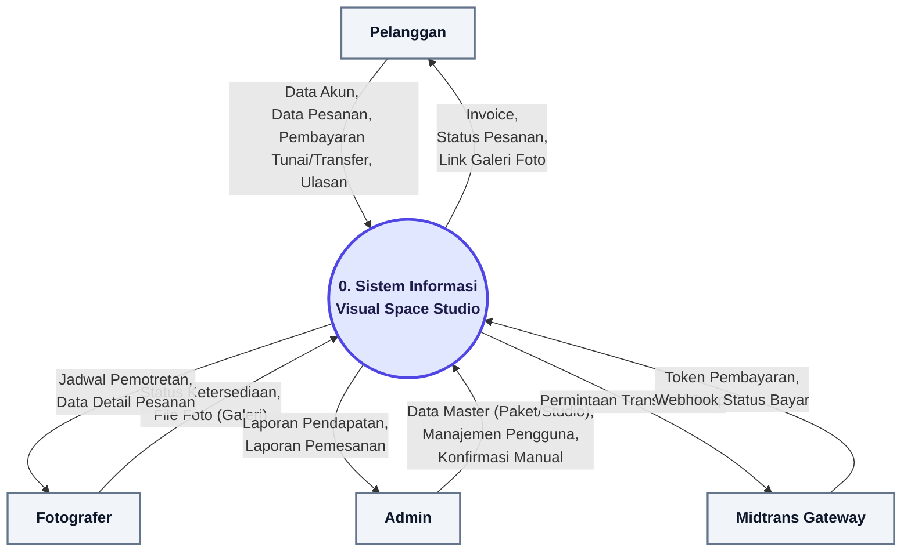
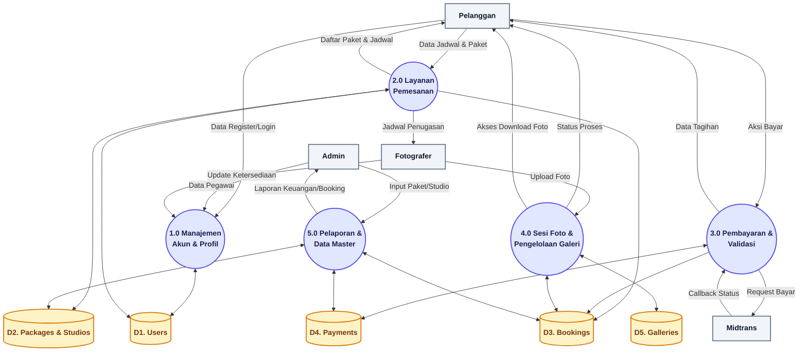
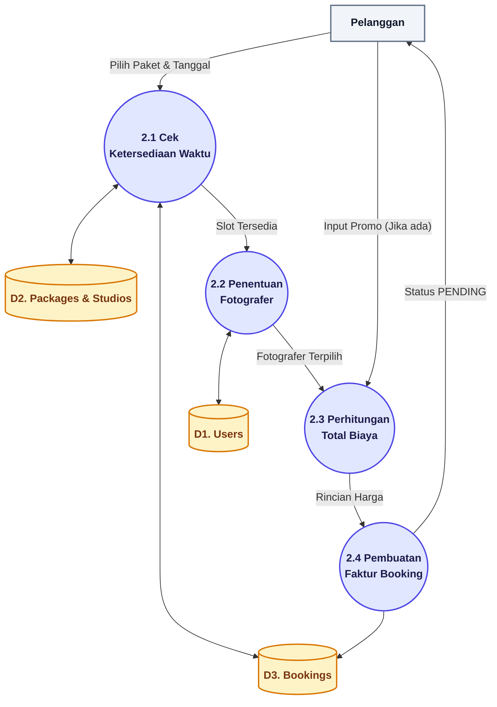
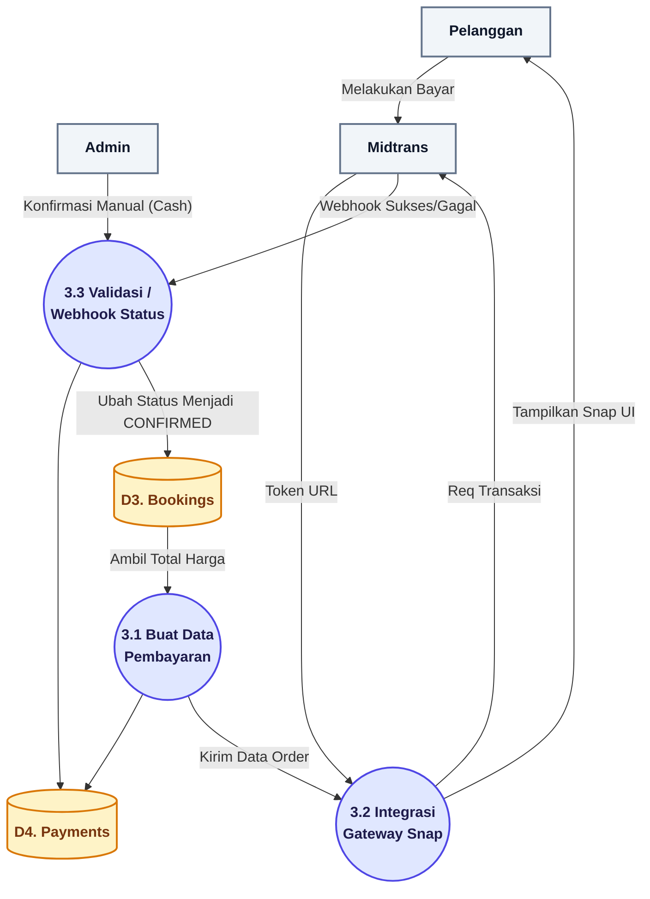

# Data Flow Diagram (DFD) - Visual Space Studio

Dokumen ini menjelaskan alur aliran data (Data Flow) di dalam Sistem Informasi Visual Space Studio, yang dijabarkan dari DFD Level 0 (Konteks Diagram) hingga DFD Level 2.

---

## 1. DFD Level 0 (Context Diagram)

Diagram Konteks menunjukkan interaksi sistem secara keseluruhan dengan entitas eksternal.

---

## 2. DFD Level 1

Pada DFD Level 1, sistem utama (0) dipecah menjadi beberapa proses utama, yang berinteraksi dengan **Data Store** (Basis Data).

---

## 3. DFD Level 2 (Dekomposisi Proses 2.0 - Layanan Pemesanan)

Ini adalah perincian atau dekomposisi dari proses **2.0 Layanan Pemesanan**, menunjukkan lebih detail bagaimana sistem menangani alur *booking*.

---

## 4. DFD Level 2 (Dekomposisi Proses 3.0 - Pembayaran & Validasi)

Ini adalah perincian dari proses **3.0 Pembayaran**, memperlihatkan bagaimana Gateway Midtrans terintegrasi.

